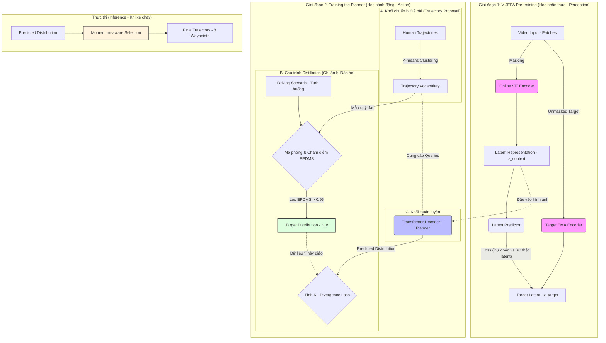

# Drive-JEPA: Video JEPA Meets Multimodal Trajectory Distillation for End-to-End Driving - Review

## Cấu trúc hệ thống (Kiến trúc Drive-JEPA)

Hệ thống có hai giai đoạn chính, tương ứng với việc huấn luyện "não bộ" (Pretraining) và "kỹ năng lái" (Planning).

