# Báo cáo tổng hợp ngày 11/09/26

## Các công việc đã thực hiện

### 1. Về Đánh Giá Không Gian Ẩn & Khoảng Cách Miền (Latent Space & Domain Gap)

* **Xây dựng bộ dữ liệu đánh giá chuẩn hóa:** Dựng lại và làm sạch bộ dữ liệu Việt Nam gồm 353 ảnh tĩnh rời (chia thành các nhóm: `xe_di_biet`, `missing_markings`, `overloaded_bike`, `rain_day`, `rain_night`), loại bỏ ảnh lỗi/đen/nhòe và dùng pHash chống trùng lặp, đồng thời giữ nguyên tập chuẩn quốc tế OpenScene (Âu/Mỹ) làm mốc tham chiếu ngoài.
* **Đánh giá định lượng qua Predictor-Reconstruction:**
  * Áp dụng hai chỉ số cốt lõi: **Cosine Similarity** (đo độ tương đồng ngữ nghĩa của Predictor so với Target-Encoder sau khi qua LayerNorm) và **Khoảng cách Mahalanobis** (đo độ lệch phân phối OOD của phần sai số residual so với phân phối chuẩn OpenScene).
  * **Kết quả đạt được:** Chứng minh bằng toán học rằng khoảng cách vùng miền (domain gap) biểu hiện đơn điệu; OpenScene đạt kết quả tốt nhất (Cosine cao nhất, Mahalanobis thấp nhất), trong khi mọi nhóm cảnh Việt Nam đều kém hơn. Các nhóm ban ngày khô ráo vẫn lệch rõ so với OpenScene (chứng minh domain gap đến từ nội dung cảnh lái xe chứ không chỉ do thời tiết); trong đó đường mất vạch gần OpenScene nhất, còn mưa ban đêm và xe dị hình khó tái tạo nhất.
* **Đánh giá đặc trưng không - thời gian qua chuỗi video (Temporal Metrics):**
  * Phân tích sâu các chỉ số trên 685 mẫu cửa sổ thời gian từ các video thực tế (`predictor_l2`, `effective_rank`, `temporal_cosine_collapse`, v.v.).
  * **Kết quả đúc kết:** Giải mã các hiện tượng vật lý qua con số (ví dụ: các tình huống va chạm/ngõ khuất tạo ra cú giật L2 cực đại và sụp đổ cục bộ `Effective Rank`; thời tiết mưa làm tăng `Effective Rank` do nhiễu texture nhưng kéo sụt `Temporal Cosine Collapse`; camera hành trình R3000 đẩy baseline L2 lên cao do nhiễu phần cứng cố định).

### 2. Về Chuyển Đổi HD Map & Đồng Bộ Dữ Liệu (NAVSIM / nuPlan)

* **Giải quyết bài toán phụ thuộc Map – NAV – Sensor:** Làm rõ nguyên tắc bắt buộc các dữ liệu này phải cùng một cảnh quay thực tế, cùng hệ tọa độ và quá trình căn chỉnh thì điểm số PDM mới có ý nghĩa.
* **Hoàn thành chuyển đổi HD Map VinFast sang chuẩn NAVSIM/nuPlan:**
  * Xây dựng thành công bộ chuyển đổi đưa bản đồ VF sang định dạng GeoPackage tương thích NAVSIM/nuPlan (`map.gpkg`).
  * Xây dựng đầy đủ các lớp (layers) bản đồ quan trọng: `baseline_paths`, `boundaries`, `lanes_polygons`, `lane_connectors`, `road_segments`, `intersections`, `crosswalks`, `carpark_areas`, v.v., theo hệ tọa độ chuẩn `EPSG:4326`.
* **Liên kết Log / Scene:** Gắn kết thành công map với log dữ liệu (scene_token, log_token), tích hợp 8 kênh camera, tuyến đường (`roadblock_ids` gồm 93 phần tử) và trạng thái dynamic ego đầy đủ.

### 3. Về System Integration, Huấn Luyện & Đánh Giá Planner (Drive-JEPA)

* **Vận hành Pipeline System Integration:**
  * Thiết lập môi trường huấn luyện và đánh giá cho Drive-JEPA bản *perception-free* trên dữ liệu VinFast.
  * Lưu trữ 2,781 kịch bản từ OpenScene và chạy đánh giá trên 242 kịch bản kiểm thử (đạt điểm trung bình 0.907 / 90.7%).
* **Huấn luyện mô hình (Training):**
  * Khởi tạo và chạy train thành công mô hình Drive-JEPA (perception-free) trên bộ dữ liệu converted mới với quy mô 2,828 samples, hoàn tất vòng chạy `max_epochs=1` và lưu checkpoint thành công (`epoch=0-step=89.ckpt`).
* **Đánh giá PDM One-Stage (Evaluation):**
  * Thực thi job eval trên toàn bộ 2,828 scenarios, thu được các giá trị metric ban đầu: `ego_progress` trung bình đạt `0.9004`, `lane_keeping` đạt `0.2284`, và `two_frame_extended_comfort` đạt `0.6491`.

## Đề xuất kiến trúc mô hình xe tự lái mới phù hợp với bối cảnh giao thông tại Việt Nam và tập dữ liệu hạn chế

### Đặt vấn đề và Động lực nghiên cứu

Các kiến trúc mô hình lái xe tự hành End-to-End tiên tiến hiện nay (tiêu biểu như **Drive-JEPA**) phụ thuộc nghiêm trọng vào các bộ mô phỏng ngoại vi (như NAVSIM) và yêu cầu khắt khe về siêu dữ liệu (Privileged metadata) gồm nhãn 3D Bounding Box hoàn chỉnh và bản đồ độ phân giải cao (HD-Map). Điều này dẫn đến hai điểm nghẽn lớn khi áp dụng vào thực tế giao thông tại Việt Nam:

1. **Data Gap & Annotation Cost:** Chi phí và công sức gán nhãn thủ công các đối tượng phức tạp (xe máy luồn lách, xe chở hàng cồng kềnh, người đi bộ tự phát) là cực kỳ lớn và kém mở rộng.
2. **Control-Centric & Temporal Blindness:** Cơ chế masking ngẫu nhiên $16 \times 16$ bản gốc vô tình làm "mù" các vật thể nhỏ ở xa, kết hợp với việc thiếu nhánh thông tin chuyển động động lực học, khiến mô hình dễ bị sốc trước các tình huống tạt đầu, lấn làn đột ngột.

Để giải quyết triệt để các hạn chế trên, kiến trúc đề xuất xây dựng một hệ thống **Nhận thức tự giám sát kết hợp Nhân quả (Causal Self-Supervised Perception)** và **Lập kế hoạch nội tại không cần mô phỏng (Evaluator-Free Closed-Loop Planning)**, được chia thành 3 khối chiến lược chính.

```
[Camera] ──► (Khối 1: Latent & Confounder Representation)
                                 │
                                 ▼ Vector z_t = z_task,t + z_exo,t & Vector U_t
   (Khối 2: Action-Conditioned SCM Predictor & Planner) ──► Hành động a_t*
                                 │
                                 ▼ Vòng lặp kín do(a_t) ➔ z_t+1
   (Khối 3: Evaluator-Free Closed-Loop Eval)

```

### Các Khối Chức năng Cốt lõi của Kiến trúc Đề xuất

### Khối 1: Nhận thức Tự giám sát & Ước lượng Confounder (Self-Supervised Perception & Confounder Estimation)

```mermaid
%%{init: {
  'themeVariables': {
    'fontSize': '28px'
  },
  'flowchart': {
    'nodeSpacing': 80
  }
}}%%
flowchart LR
    %% ==========================================
    %% INPUTS
    %% ==========================================
    subgraph IN ["Inputs"]
        direction TB
        RGB["RGB Frames"]
    end

    %% ==========================================
    %% 1. FEATURE EXTRACTION & FUSION
    %% ==========================================
    subgraph FEAT ["<b>1. Feature Extraction & Gated Fusion<b>"]
        direction TB
        Spacer[" "]
        style Spacer fill:none,stroke:none
        subgraph ENCODERS ["Encoders"]
            direction LR
            StaticEnc["Frozen Drive-JEPA ViT"]

            subgraph MOTION_BRANCH ["Motion Branch"]
                direction TB
                FlowEst["Frozen FlowFormer++"]
                FlowEnc["Flow Encoder"]
                FlowEst --> FlowEnc
            end
        end

        Fusion["Gated Cross-Attention Fusion"]

        StaticEnc -->|e_static| Fusion
        FlowEnc -->|e_flow| Fusion
    end

    %% ==========================================
    %% 3. PREDICTION & LOSS
    %% ==========================================
    subgraph PRED_LOSS ["<b>3. Prediction & Loss<b>"]
        direction TB
        Masking["Spatiotemporal Masking"]
        Pred["Causal Predictor"]
        Losses["Losses: L_JEPA + L_orth + L_recon"]

        Masking --> Pred --> Losses
    end

    %% ==========================================
    %% 2. CAUSAL LATENT PROCESSING
    %% ==========================================
    subgraph CAUSAL ["<b>2. Factorization & Confounder<b>"]
        direction TB
        Factorizer["Latent Factorizer"]
        ConfGRU["ConfounderGRU"]

        Factorizer -->|z_task & z_exo| Losses
        ConfGRU -->|Confounder U_t| Pred
    end

    %% ==========================================
    %% MAIN CONNECTION FLOW
    %% ==========================================
    RGB --> StaticEnc
    RGB --> FlowEst

    Fusion -->|z_t| Factorizer
    Fusion -->|z_t| ConfGRU
    Factorizer -->|z_task| Masking

    %% ==========================================
    %% STYLING
    %% ==========================================
    style IN fill:none,stroke:#333,stroke-width:3px
    style FEAT fill:none,stroke:#333,stroke-width:3px
    style ENCODERS fill:none,stroke:#aaa,stroke-width:2px,stroke-dasharray: 3 3
    style MOTION_BRANCH fill:none,stroke:#bbb,stroke-width:4px
    style CAUSAL fill:none,stroke:#333,stroke-width:3px
    style PRED_LOSS fill:none,stroke:#333,stroke-width:3px

    classDef whiteNode fill:#ffffff,stroke:#333333,stroke-width:3px;
    classDef frozen fill:#f9f9f9,stroke:#666666,stroke-width:3px,stroke-dasharray: 5 5;
    classDef trainable fill:#e1f5fe,stroke:#0288d1,stroke-width:4px;
    classDef loss fill:#ffebee,stroke:#c62828,stroke-width:3px;

    class RGB,Masking whiteNode;
    class StaticEnc,FlowEst frozen;
    class FlowEnc,Fusion,Factorizer,ConfGRU,Pred trainable;
    class Losses loss;

    linkStyle default stroke-width:3px;
```



Nhằm giữ lại trọng số pre-train khổng lồ của mô hình thế giới gốc đồng thời tăng độ nhạy với các tác nhân giao thông đặc thù tại Việt Nam, Khối 1 cải tiến cấu trúc nhận thức thông qua các trụ cột:

* **Mã hóa hỗn hợp Tĩnh - Động Tối ưu (Frozen ViT + FlowFormer++):** Đóng băng toàn bộ trọng số của bộ mã hóa tĩnh (`Frozen ViT`) để cắt giảm hơn $70\%$ chi phí tính toán Backpropagation. Đồng thời, tích hợp nhánh dòng quang siêu nhẹ (`FlowFormer++`) để trích xuất ma trận vận tốc pixel, đóng vai trò là định kiến quy nạp (*Inductive Bias*) ép mô hình tập trung vào dòng xe máy di chuyển sát hông xe. Hai nhánh được dung hòa thông qua cơ chế cổng tàn dư khởi tạo bằng $0$ (`Zero-Initialized Residual Gate`) nhằm đảm bảo tính tương đương toán học khi suy biến.
* **Phân mảnh Không gian Ẩn Nhân quả (Latent Space Factorization) & Confounder Estimation:** Tách không gian ẩn tổng hợp $z_t \in \mathbb{R}^{N \times D}$ thành hai thành phần trực giao:
  * $z_{\text{task}, t}$: Biến đặc trưng chịu sự chi phối trực tiếp bởi hành động điều khiển $a_t$ của xe chủ.
  * $z_{\text{exo}, t}$: Biến ngoại sinh hoàn toàn độc lập với hành động lái xe (như cảnh quan cố định, thời tiết).
  * Đồng thời, sử dụng một `GRU Confounder Encoder` để trích xuất vector ngữ cảnh ẩn $U_t$ từ chuỗi lịch sử nhằm cô lập các yếu tố không quan sát trực tiếp.

### Khối 2: Dự đoán Thế giới Ẩn Nhân quả & Lập kế hoạch (Action-Conditioned Latent SCM Predictor & Planner)

```
========================================================================================
NHÁNH A: BỘ DỰ ĐOÁN THẾ GIỚI ẨN NHÂN QUẢ (ACTION-CONDITIONED LATENT SCM PREDICTOR)
========================================================================================

  Biến tương tác z_task,t ───┐
  Hành động Planner a_t  ────┼─► [ Task Predictor g_φ,task ] ────► Tọa độ ẩn tương lai ẑ_task,t+1
  Biến Confounder U_t ───────┘                                          │
                                                                        ├─► ẑ_t+1 = [ẑ_task,t+1, ẑ_exo,t+1]
  Biến ngoại sinh z_exo,t ───► [ Exo Predictor g_φ,exo ]  ───► Tọa độ ẩn tương lai ẑ_exo,t+1
                                                                        │
                                                                        ▼ (Tính Causal Dynamics Loss)
                                                              Tọa độ ẩn thực tế z_t+1

========================================================================================
NHÁNH B: BỘ LẬP KẾ HOẠCH & DỪNG SỚM ANYTIME VALID (LATENT RL PLANNER)
========================================================================================

  Trạng thái z_t ──► [ RL Policy Agent ] ──► Quỹ đạo đề xuất W̃_L (32 phương án)
                                   │
                                   ├───────────────────────────► (Tính Loss bắt chước GT W_t)
                                   ▼
                   [ Tự kiểm thử an toàn nội tại ]
                   - Thử nghiệm do(A^(k)) qua SCM Predictor (Chỉ Rollout trên z_task)
                   - Anytime Valid Early-Stopping Rollout (Ville's Inequality):
                     Ngắt ngay các rollout có e-process rủi ro E_τ ≥ 1/α

```

Thay vì vứt bỏ bộ dự đoán sau pha tiền huấn luyện hoặc phụ thuộc vào Simulator ngoài, hệ thống nâng cấp Predictor thành mô hình cấu trúc nhân quả (*Structural Causal Model - SCM*):
* **Toán tử Can thiệp ($do$-operator) & Giảm tải tính toán:** Mô hình hóa động lực học không gian ẩn tuân theo toán tử can thiệp $do(a_t)$ của Pearl. Khi sinh 32 quỹ đạo ứng viên ($a_t^{(k)}$), hệ thống chỉ tính toán biến ngoại sinh $z_{\text{exo}, t+1}$ đúng một lần duy nhất và áp dụng can thiệp trên nhánh $z_{\text{task}}$, giúp cắt giảm từ $30\% - 40\%$ số phép tính Rollout GPU dư thừa.
* **Anytime Valid Early-Stopping Rollout (Bất đẳng thức Ville):** Tích hợp kiểm định e-process rủi ro an toàn $E_\tau^{(k)}$ trong quá trình sinh quỹ đạo giả định. Ngắt ngay lập tức các quỹ đạo có nguy cơ va chạm cao trước khi hoàn thành đủ $H$ bước, tiết kiệm thêm từ $50\% - 70\%$ tài nguyên tính toán.
* **Học bắt chước gián tiếp (Implicit Imitation) kết hợp An toàn Hình học Thô:** Huấn luyện bộ lập kế hoạch (RL Policy Agent) bám sát quỹ đạo thực tế của tài xế con người ($W_t$) kết hợp hàm phạt an toàn dựa trên khoảng cách đám mây điểm LiDAR thô ($\mathcal{P}_{\text{LiDAR}}$) mà không cần nhãn 3D Box.

### Khối 3: Đánh giá Vòng kín Không cần Nhãn (Evaluator-Free Closed-Loop Evaluation)

```
========================================================================================
BỘ ĐÁNH GIÁ 1: KIỂM THỬ NGOẠI TUYẾN (OFFLINE EVALUATION)
========================================================================================

  Quỹ đạo đề xuất W̃_L (32 phương án) ──► [ Bộ chọn quỹ đạo tối ưu W̃* ]
                                                      │
                                                      ├─► [So sánh GT W_t] ──► ADE / FDE (Độ giống người)
                                                      │
                                                      └─► [Check Va chạm] ──► Raw-LiDAR Collision Rate


========================================================================================
BỘ ĐÁNH GIÁ 2: MÔ PHỎNG VÒNG KÍN TRONG KHÔNG GIAN ẨN (LATENT CLOSED-LOOP SIMULATION)
========================================================================================

  Trạng thái ẩn z_t ──► [ Planner Agent ] ──► Hành động đề xuất a_t*
                                ▲                     │
                                │                     ▼
                                └─────────── [ SCM Predictor P_φ ] ──► ẑ_t+1 (Vòng lặp kín)
                                                      │
                                                      ▼
                                            [ Check An toàn & Trôi ẩn ]
                                            - Latent Drift Rate (LDR)
                                            - Latent Hazard Invasion (LHI)
                                            - [Math] Anytime Valid Sequential e-Testing
```

Xây dựng phương pháp luận đánh giá thay thế hoàn toàn môi trường mô phỏng đồ họa 3D truyền thống:

* **Latent Closed-Loop Simulation:** Cho phép tác nhân lập kế hoạch tự tương tác trực tiếp vòng kín với bộ SCM Predictor đã đóng băng trong không gian ẩn suốt chuỗi 10 giây giả định.
* **Chỉ số Đánh giá Toàn diện:**
  * *Human-Fidelity Metrics:* ADE, FDE so với quỹ đạo thực tế con người.
  * *Raw-Geometric Safety Metrics:* Tỷ lệ va chạm đám mây điểm thô (`Raw Collision Rate - RCR`) và tỷ lệ lấn vạch (`RVR`).
  * *Sequential e-Testing:* Áp dụng kiểm định thống kê nối tiếp theo thời gian thực giúp rút ngắn từ $40\% - 60\%$ tổng thời gian kiểm thử nghiệm thu mô hình.

## 3. Tổng kết Tối ưu hóa Tài nguyên & Hiệu năng

| Khối Kiến trúc | Công cụ Toán học & Kỹ thuật | Hiệu quả Cắt giảm Tài nguyên & Thực thi |
| --- | --- | --- |
| **Khối 1: Nhận thức** | Transfer Learning & Zero-Init Residual Fusion | Giảm **>70% chi phí huấn luyện Backpropagation** của bộ mã hóa. |
| **Khối 2: Dự đoán & Lập kế hoạch** | Latent SCM & $do$-operator ($z_{\text{task}}$ vs $z_{\text{exo}}$) | Giảm **30% - 40% phép tính Rollout** dư thừa trên GPU. |
| **Khối 2: Dự đoán & Lập kế hoạch** | Anytime Valid Inference (Ville's Inequality) | Cắt giảm thêm từ **50% đến 70%** số phép tính Rollout đối với các quỹ đạo nguy hiểm. |
| **Khối 3: Đánh giá Vòng kín** | Evaluator-Free Latent Simulation & e-Testing | Rút ngắn **40% – 60% tổng thời gian kiểm thử** mà không cần Simulator 3D. |

## Tham khảo

### 1. Nền tảng Học tự giám sát & Backbone Gốc (Self-Supervised Learning)

* **JEPA (Joint Embedding Predictive Architecture - Yann LeCun):** Nguyên lý học biểu diễn (representation learning) trong không gian ẩn để tránh ảo giác và giảm chi phí GPU so với các mô hình sinh (Generative/Pixel-based).
* **Drive-JEPA / V-JEPA (Meta AI):** Bộ trích xuất đặc trưng không gian - thời gian tĩnh nền tảng (Frozen ViT $16 \times 16$) giúp bảo toàn toàn bộ tri thức pre-train về môi trường giao thông.

### 2. Ước lượng Dòng quang Siêu nhẹ (Lightweight Motion Perception)

* **Cơ sở lý thuyết:**
  * [FlowFormer++: Masked Cost Volume Autoencoding for Pretraining Optical Flow Estimation](https://arxiv.org/pdf/2303.01237)
  * FlowFormer++ / Transformer-Based Flow: Dòng kiến trúc tiên tiến dựa trên Transformer tích hợp cơ chế ghép cặp chi phí toàn cục (cost volume) kết hợp với thiết kế hiệu quả, mang lại độ chính xác vượt trội trong việc giải quyết các bài toán che khuất phức tạp và chuyển động lớn.
  * Được cân nhắc tích hợp làm nhánh dòng quang thay thế cho LiteFlowNet3 trong trường hợp hệ thống ưu tiên độ chính xác tuyệt đối của trường vận tốc pixel ở vùng sát mặt đường, bất chấp chi phí tính toán cao hơn một chút.
* **Nhóm mạng khác:**
  * [Fastflownet: A lightweight network for fast optical flow estimation](https://arxiv.org/pdf/2103.04524)
  * [LiteFlowNet3: Resolving Correspondence Ambiguity for More Accurate Optical Flow Estimation](https://arxiv.org/pdf/2007.09319)

* **LiteFlowNet3 / FastFlow:** Các công trình nghiên cứu mạng ước lượng Dòng quang (Optical Flow) với chi phí tính toán cực thấp. Nhánh này đóng vai trò tạo định kiến quy nạp (Inductive Bias) về vận tốc pixel, giúp phát hiện các chuyển động nhỏ, nhanh, góc cua gắt sát hông xe.

* **Baseline để so sánh:**
  * [RAFT: Recurrent All-Pairs Field Transforms for Optical Flow](https://arxiv.org/pdf/2003.12039)

* **Tại sao không dùng RAFT:** Mặc dù RAFT có độ chính xác cao hơn, nhưng chi phí tính toán quá lớn (gấp 10 lần LiteFlowNet3) và không phù hợp với pipeline tự giám sát cần tiết kiệm GPU.

### 3. Lý thuyết Nhân quả & Ước lượng Biến ẩn (Causality & Confounder Estimation)

* **Cơ sở lý thuyết:**
  * [A Survey on Causal Reinforcement Learning](https://arxiv.org/pdf/2302.05209)
  * [Markov Decision Processes with Unobserved Confounders: A Causal Approach](https://causalai.net/mdp-causal.pdf)
  * [Causal Imitation for Markov Decision Processes: a Partial Identification Approach](https://proceedings.neurips.cc/paper_files/paper/2024/file/9f7f2f57d8eaf44b2f09020f64ff6d96-Paper-Conference.pdf)

* **Chứng minh:** Trong dữ liệu thực tế, tồn tại biến ẩn $U_t$ (như ý định tài xế) ảnh hưởng đồng thời đến quyết định hành động $A_t$ và trạng thái tiếp theo $S_{t+1}$, tạo ra đường dẫn sau (Backdoor Path): $A_t \leftarrow U_t \rightarrow S_{t+1}$.
Nếu huấn luyện RL thông thường, phân phối quan sát $P(S_{t+1} \mid S_t, A_t)$ bị lệch so với phân phối can thiệp thực sự $P(S_{t+1} \mid do(A_t), S_t)$:

$$P(S_{t+1} \mid S_t, A_t) = \sum_{u} P(S_{t+1} \mid S_t, A_t, u) \cdot P(u \mid S_t, A_t) \neq P(S_{t+1} \mid do(A_t), S_t)$$

Bằng việc thêm mạng **GRU Confounder Encoder** để trích xuất $U_t$ ở Pha 1 và cố định $U_t$ trong bước Abduction, hệ thống giải điều kiện $P(u \mid S_t, A_t)$ thành $P(u)$, triệt tiêu hoàn toàn đường backdoor và đảm bảo tính đúng đắn của toán tử $do(A_t)$.

### 4. Phân mảnh Không gian Ẩn (Latent Space Factorization)

* **Kỹ thuật Phân tách Trực giao (Orthogonal Space Separation):**
  * [Domain Separation Networks](https://proceedings.neurips.cc/paper_files/paper/2016/file/45fbc6d3e05ebd93369ce542e8f2322d-Paper.pdf)
    * Công trình tiên phong đề xuất việc phân tách không gian ẩn thành thành phần riêng biệt (private) và thành phần chung (shared) thông qua **Hàm phạt Trực giao (Difference Loss / Orthogonality Penalty)** $\left\Vert Z_{\text{shared}}^T Z_{\text{private}} \right\Vert_F^2$.
  * [Disentangling Factors of Variation in Deep Representation Using Adversarial Training](https://proceedings.neurips.cc/paper_files/paper/2016/file/ef0917ea498b1665ad6c701057155abe-Paper.pdf)
    * Chứng minh toán học việc chia nhỏ latent vector bằng các phép chiếu tuyến tính trực giao giúp giữ lại các thông tin biến thiên độc lập mà không bị hiện tượng trôi lệch thông tin (information leakage).

* **Lý thuyết Học biểu diễn Nhân quả (Causal Representation Learning):**
  * [Toward Causal Representation Learning](https://ieeexplore.ieee.org/iel7/5/9420072/09363924.pdf)
    * Đặt ra tuyên ngôn: *Không gian ẩn của mô hình AI phải phản ánh đúng các cơ chế nhân quả độc lập của thế giới thực (Independent Causal Mechanisms - ICM)*.
  * [Self-Supervised Learning with Data Augmentations Provably Isolates Content from Style](https://proceedings.neurips.cc/paper_files/paper/2021/file/8929c70f8d710e412d38da624b21c3c8-Paper.pdf)
    * Chứng minh bằng định lý toán học (Provable Guarantees) rằng việc kết hợp Self-Supervised Learning (như JEPA) với các ràng buộc không gian con cho phép mô hình cô lập hoàn toàn thành phần cốt lõi ($z_{\text{task}}$) khỏi nhiễu nền/ngoại sinh ($z_{\text{exo}}$).
  * [CausalVAE: Disentangled Representation Learning via Neural Structural Causal Models](https://discovery.ucl.ac.uk/id/eprint/10142668/1/2004.08697.pdf)
    * Cung cấp cơ chế biến đổi đại số tuyến tính để ánh xạ từ một latent vector chưa phân cấu trúc sang một mô hình nhân quả cấu trúc (SCM) thông qua ma trận biến đổi tuyến tính.
