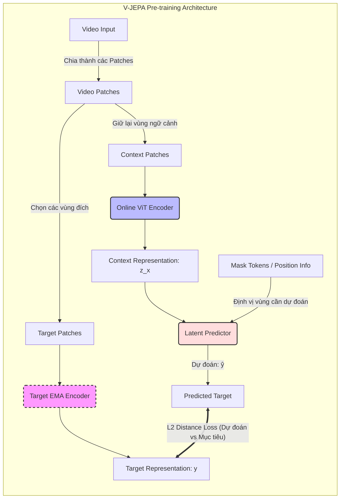

# Tổng hợp về V-JEPA2

## JEPA đóng vai trò gì trong World Model?

Trong kiến trúc mô hình thế giới tiêu chuẩn, chúng ta thường có 3 phần: **Perception** (Nhìn), **World Model** (Dự đoán) và **Policy** (Hành động). JEPA gộp cả "Nhìn" và "Dự đoán" vào một cấu trúc thống nhất.

* **Thay thế việc "Mô phỏng hình ảnh" bằng "Mô phỏng ý nghĩa":** Các World Model cũ (như của Ha & Schmidhuber) cố gắng dự đoán từng pixel tiếp theo (như một giấc mơ bằng hình ảnh). JEPA thì khác, nó dự đoán **vector đặc trưng (Latent Space)**.
    * *Ví dụ:* Thay vì dự đoán chính xác màu sắc của từng cái lá cây khi xe chạy qua, JEPA chỉ cần dự đoán: "Phía trước có một vật cản tĩnh". Điều này giúp World Model tập trung vào các quy luật vật lý quan trọng thay vì chi tiết thừa.

* **Khả năng tự giám sát (Self-Supervised):** World Model cần học từ một lượng dữ liệu khổng lồ mà không cần nhãn. Cơ chế **Masking** của JEPA (che đi một phần video và bắt mô hình đoán phần còn lại) chính là cách nó tự xây dựng hiểu biết về quy luật vận động của thế giới (thời gian, trọng lực, quỹ đạo).

Hãy so sánh với cách tiếp cận cũ:
* **Generative World Models (VAE/GAN):** Cố gắng tạo ra hình ảnh tương lai. Rất tốn kém tài nguyên và dễ bị nhiễu (ví dụ: dự đoán sai vệt nắng trên đường làm xe phanh gấp).
* **JEPA World Model:** Chỉ dự đoán những đặc trưng cần thiết cho việc ra quyết định. Nó bỏ qua những chi tiết không liên quan đến việc lái xe, giúp mô hình ổn định và chính xác hơn rất nhiều.

## Chart

## V-JEPA là mô hình gì?

**V-JEPA** (Video Joint-Embedding Predictive Architecture) là một kiến trúc học máy được giới thiệu bởi **Meta AI (Yann LeCun)**.

* **Không phải mô hình tạo ảnh:** Nó không giống VAE hay GAN (không vẽ lại điểm ảnh).
* **Học đặc trưng (Feature Learning):** Nó học cách hiểu "nội dung" của video bằng cách che đi một phần các khối hình ảnh (masking) và bắt mô hình dự đoán **vector đặc trưng** của phần bị che đó trong không gian tiềm ẩn (Latent Space).
* **World Model:** Trong dự án của bạn, V-JEPA đóng vai trò là "đôi mắt" và "sự hiểu biết" về thế giới vật lý cho xe.

## Bộ dữ liệu huấn luyện V-JEPA (Pre-training) trong Drive-JEPA

Bài báo không chỉ sử dụng một nguồn mà kết hợp các tập dữ liệu quy mô lớn để xây dựng "nhận thức" cho mô hình:

* **Dữ liệu chính:** Họ sử dụng tập dữ liệu **nuPlan** (một phần của hệ sinh thái nuScenes). Đây là tập dữ liệu lái xe tự hành quy mô lớn nhất hiện nay với hàng nghìn giờ video thực tế.
* **Mục tiêu:** Huấn luyện **V-JEPA Encoder** theo phương thức tự giám sát (self-supervised) để học cách trích xuất các đặc trưng (features) có khả năng dự đoán tương lai mà không cần nhãn dán thủ công.

### Chi tiết kỹ thuật về Input Data trong bài báo

Bài báo làm rõ cách họ xử lý dữ liệu này để đưa vào V-JEPA:
* **Nguồn nhìn:** Chỉ sử dụng duy nhất **Front Camera** (Camera trước).
* **Độ phân giải:** Hình ảnh được đưa về kích thước **$512 \times 256$**.
* **Cấu trúc thời gian:** Họ sử dụng các cặp khung hình $I_t$ và $I_{t-1}$ (khung hình hiện tại và khung hình trước đó), tạo thành một tensor đầu vào có kích thước $2 \times 512 \times 256$.

Với bộ dữ liệu VF ta thực hiện theo quy trình sau:

#### **Bước 1: Sử dụng bộ Weights có sẵn (Pre-trained)**
Sử dụng lại các bộ trọng số (weights) của Drive-JEPA được huấn luyện trên các tập dữ liệu video lái xe khổng lồ của họ.
* **Ưu điểm:** Mô hình đã có sẵn khái niệm về "vật thể", "chuyển động", "trọng lực".
* **Hành động:** Có thể tải bộ weights này về để làm điểm khởi đầu (Backbone).

#### **Bước 2: Huấn luyện lại / Fine-tuning**
Mặc dù có sẵn, nhưng **phải huấn luyện lại (hoặc fine-tune)** trên dữ liệu camera của VinFast vì:
* **Góc nhìn đặc thù:** Dữ liệu của Drive-JEPA có thể từ camera hành trình góc rộng, trong khi camera VinFast có độ cao, góc nhìn và tiêu cự khác.
* **Bối cảnh giao thông:** V-JEPA cần được "làm quen" với các thực thể đặc thù tại Việt Nam (xe máy dày đặc, dải phân cách mềm, biển báo tiếng Việt).
* **Độ phân giải:** Bài báo Drive-JEPA sử dụng độ phân giải **512x256**. Bạn cần huấn luyện lại để Encoder tương thích hoàn toàn với cấu hình này.

### Tiền xử lý: Patchification & Masking

* **Toán học:** Video đầu vào là một khối dữ liệu 4D (Thời gian $\times$ Kênh $\times$ Cao $\times$ Rộng). Ta chia nó thành các khối nhỏ gọi là **3D Patches** ($P \times P \times T$).
* **Masking:** Ta chọn ngẫu nhiên một phần lớn các khối và **che (mask)** chúng đi.
    * Phần nhìn thấy gọi là $x_{context}$.
    * Phần bị che gọi là $x_{target}$.

## Kiến trúc JEPA & Cơ chế EMA Vision Encoder

Trong Drive-JEPA, có **hai bộ Encoder** chạy song song:
1.  **Online Encoder ($E_\theta$):** Đây là bộ não đang học, trọng số $\theta$ được cập nhật liên tục qua từng bước huấn luyện bằng Gradient Descent.
2.  **Target Encoder ($E_{ema}$):** Đây chính là **EMA Vision Encoder**.

**EMA (Exponential Moving Average - Trung bình trượt lũy thừa)** là gì?

Thay vì cập nhật trọng số bằng Gradient, trọng số của $E_{ema}$ được tính bằng công thức:
$$\theta_{ema} \leftarrow m \cdot \theta_{ema} + (1 - m) \cdot \theta_{online}$$
*(Với $m$ thường rất cao, khoảng 0.999)*.

* **Tại sao cần EMA?**
    * **Tránh sụp đổ (Collapsing):** Nếu chỉ có 1 Encoder, mô hình rất dễ "ăn gian" bằng cách biến mọi hình ảnh thành một vector hằng số (bằng 0 hết chẳng hạn), lúc đó Loss sẽ bằng 0 nhưng mô hình không học được gì.
    * **Tạo ra mục tiêu ổn định:** EMA đóng vai trò như một "người thầy" điềm tĩnh, thay đổi chậm rãi, giúp bộ "Online Encoder" có một cái đích ổn định để đuổi theo.

### Bộ Dự đoán (Predictor)

* **Predictor ($P_\phi$):** Nhận vào vector tiềm ẩn từ $x_{context}$ và thông tin vị trí của các khối bị che ($\text{pos}_{target}$). Nhiệm vụ của nó là đoán xem: *"Tại vị trí bị che đó, vector đặc trưng nên là gì?"*.

### Hàm mục tiêu (Loss Function) của V-JEPA

$$
\min_{\theta,\phi,\Delta y}\left\|P_\phi(\Delta y,E_\theta(x))-\text{sg}(E_{\bar\theta}(y))\right\|_1
$$

Khác với VAE (tối ưu hóa việc tái tạo ảnh), Drive-JEPA tối ưu hóa khoảng cách trong không gian tiềm ẩn (Latent space).

* $E_\theta(x)$: Online Encoder nhận vào phần video còn thấy được ($x_{context}$) và tạo ra vector tiềm ẩn.
* $\Delta y$: Thông tin vị trí của các khối bị che, giúp Predictor biết "nơi nào cần dự đoán".
* $E_{\bar\theta}(y)$: Target Encoder nhận vào phần video bị che ($x_{target}$) và tạo ra vector tiềm ẩn thực tế.
* $P_\phi(\Delta y, E_\theta(x))$: Predictor nhận vector tiềm ẩn từ Online Encoder và thông tin vị trí của các khối bị che, dự đoán vector tiềm ẩn của phần bị che.
* $\text{sg}$: Stop-Gradient, nghĩa là khi tính toán mục tiêu, chúng ta không cập nhật gradient qua nhánh này (thường dùng một bản sao của Encoder gọi là Target Encoder/Teacher).

Công thức mất mát (Loss) được tính bằng **L1 Distance** giữa vector dự đoán và vector thực tế:

$$\mathcal{L}_{JEPA} = \| P_{\phi}(E_{\theta}(x_{context}), \text{pos}_{target}) - \text{SG}(E_{\theta_{ema}}(x_{target})) \|_1$$

*Trong đó:*
* $\text{pos}_{target}$: Thông tin vị trí của các khối bị che, giúp Predictor biết "nơi nào cần dự đoán".
* $\text{SG}$ (Stop-Gradient): Nghĩa là khi tính toán mục tiêu, chúng ta không cập nhật gradient qua nhánh này (thường dùng một bản sao của Encoder gọi là Target Encoder/Teacher).

**Ý nghĩa:** AI không cố gắng đoán màu sắc từng pixel. Nó cố gắng làm cho "ý nghĩa" của phần dự đoán khớp với "ý nghĩa" của phần thực tế.

**Sự tương tác giữa các thành phần con trong công thức**

Trong công thức

$$\mathcal{L}_{JEPA} = \| P_{\phi}(E_{\theta}(x_{context}), \text{pos}_{target}) - \text{SG}(E_{\theta_{ema}}(x_{target})) \|_1$$

có 3 thực thể đang làm việc:

* **Online Encoder ($E_\theta$):** Đây là bộ não đang học, nó nhìn vào phần video còn thấy được ($x_{context}$) và tạo ra một vector tiềm ẩn. Vector này chứa thông tin về "cái gì đang xảy ra" trong video.
* ** Predictor ($P_\phi$):** Nhận vector tiềm ẩn từ Online Encoder và thông tin vị trí của các khối bị che. Nó cố gắng dự đoán vector tiềm ẩn của phần bị che ($x_{target}$).
* **Target Encoder ($E_{\theta_{ema}}$):** Đây là "người thầy" điềm tĩnh. Nó nhìn vào phần video bị che ($x_{target}$) và tạo ra vector tiềm ẩn thực tế. Vector này là mục tiêu mà Predictor cần dự đoán.

**Mục tiêu của V-JEPA Loss:** Giúp Encoder hiểu được **cấu trúc và quy luật** của video (ví dụ: hiểu rằng cái xe đang bị che khuất vẫn đang di chuyển về phía trước).

**Mục tiêu của Controller Loss (sau này):** Giúp xe chọn đúng **quỹ đạo (Trajectory)**.
