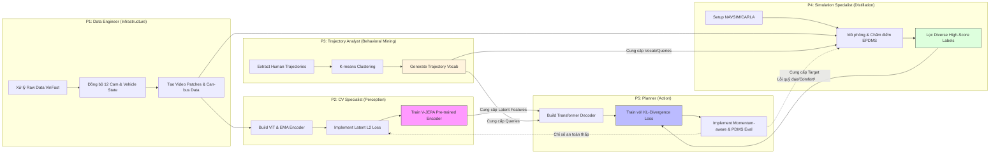

# Phân chia công việc

## Công việc tuần 09/04/26 - 15/04/26

| Người phụ trách | Công việc |
| :--- | :--- |
| Phượng | Tìm hiểu về phương pháp của Drive-JEPA và trọng tâm vào V-JEPA & Perception |
| Nam | Tìm hiểu về phương pháp của Drive-JEPA và trọng tâm vào Trajectory Analyst |
| Thành | Tìm hiểu về phương pháp của Drive-JEPA và trọng tâm vào Simulation |
| Ân | Tìm hiểu về phương pháp của Drive-JEPA và trọng tâm vào Planner |
| Ngọc | Khai phá dữ liệu Chạy thử nghiệm mô hình với dữ liệu nhỏ |

## Tổng quan

| Vai trò | Thành phần phụ trách | Nhiệm vụ chiến lược |
| :--- | :--- | :--- |
| **P1: Data Engineer** | **Infrastructure & Sync** | Quản lý kho dữ liệu thô, đồng bộ hóa Nanosecond cho 12 cam + Sensors. |
| **P2: CV Specialist** | **V-JEPA & Perception** | Huấn luyện bộ mã hóa ViT, cơ chế Masking và trích xuất Latent Features. |
| **P3: Trajectory Analyst** | **Behavioral Mining** | Trích xuất quỹ đạo người lái VinFast, chạy K-means tạo Vocabulary (8192 mẫu). |
| **P4: Sim & Distillation** | **Digital Twin & Scoring** | Vận hành NAVSIM/CARLA, chấm điểm EPDMS để tạo nhãn "thầy giáo" (Pseudo-labels). |
| **P5: Lead AI/Planner** | **Decision Making** | Xây dựng Transformer Decoder, cơ chế Momentum-aware và tối ưu KL-Loss. |

---

## Chi tiết nhiệm vụ

### P1. Hạ tầng và Tiền xử lý dữ liệu

* **Nhiệm vụ:**
    * Tập trung đồng bộ hóa Front-cam với CAN-bus dữ liệu quỹ đạo. Chuyển đổi sang định dạng video clips 8-khung hình
    * Sau đó tìm hiểu cách đồng bộ hóa 12 camera dựa trên nanosecond.
    * Thực hiện **Patchification**: Chia video thành các khối 3D (Spatiotemporal patches) để nạp vào Vision Transformer.
    * Xây dựng Dataloader tối ưu để đọc dữ liệu từ GPU (cần tốc độ cao vì dữ liệu video rất nặng).
* **Output:** Dataloader chuẩn hóa [Video Patches + Vehicle State].

### P2. Huấn luyện V-JEPA (Phần Nhìn)

* **Nhiệm vụ:**
    * Triển khai **Vision Transformer (ViT)** (Encoder và Predictor) và cơ chế EMA (Exponential Moving Average).
    * Huấn luyện Self-supervised trên video thô của VinFast (không cần nhãn).
    * Đảm bảo Encoder trích xuất được đặc trưng bền vững (invariant).
* **Output:** Trọng số (weights) của Pre-trained Encoder cung cấp Latent Features cho P5.

### P3. Chưng cất quỹ đạo (Phần Đa phương thức)

* **Nhiệm vụ:**
    * Trích xuất hàng triệu quỹ đạo từ log xe VinFast.
    * Sử dụng K-means Clustering để tạo bộ **8192 Trajectory Vocabulary**.
    * Phân tích các kịch bản đặc thù (Giao lộ đông đúc, lách xe máy) để đảm bảo Vocabulary bao phủ đủ các tình huống thực tế.
* **Output:** File Trajectory Vocabulary (định dạng .npy/.pt) cho P4 và P5.

### P4: Giả lập & Chưng cất

* **Nhiệm vụ:**
    * Thiết lập môi trường NAVSIM hoặc CARLA cho dữ liệu VinFast.
    * Nạp Trajectory Vocabulary (từ P3) vào Simulator để chấm điểm **EPDMS**.
    * Lọc ra các quỹ đạo có điểm > 0.95 để làm nhãn huấn luyện đa phương thức.
* **Output:** Bộ nhãn **Target Distribution (p_y)** cho từng kịch bản lái xe.

### P5. Lập kế hoạch và Đánh giá (Phần Điều khiển)

* **Nhiệm vụ:**
    * Xây dựng Transformer Decoder nhận đầu vào từ P2 (Ảnh) và P3 (Queries).
    * Huấn luyện mô hình khớp với nhãn từ P4 bằng KL-Divergence Loss.
    * Hiện thực logic **Momentum-aware** để xe chạy êm ái.
    * Tổng hợp kết quả và đánh giá chỉ số PDMS cuối cùng.
* **Output:** Mô hình Drive-JEPA hoàn chỉnh và báo cáo đánh giá hiệu năng trên dữ liệu VinFast.
